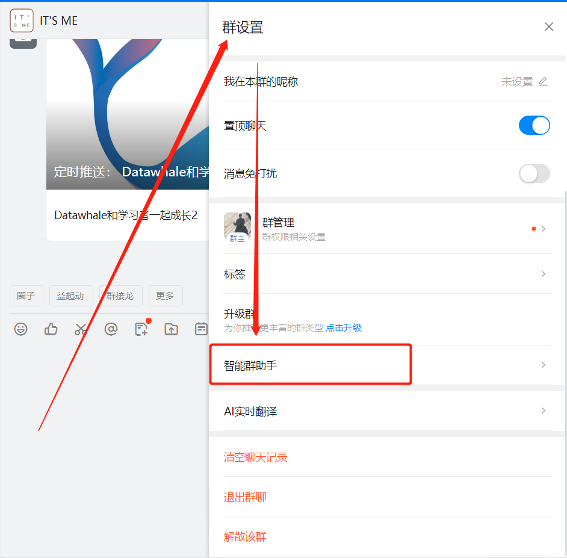
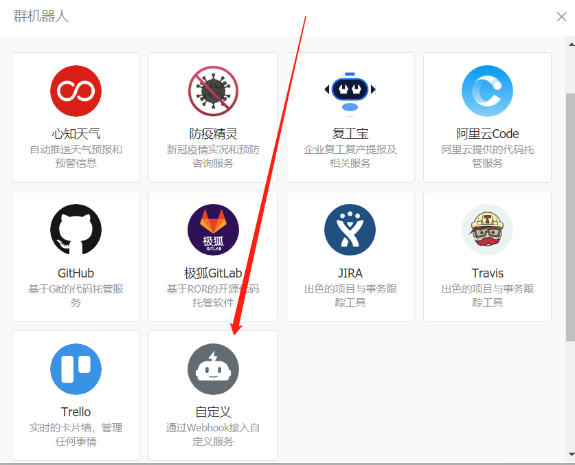
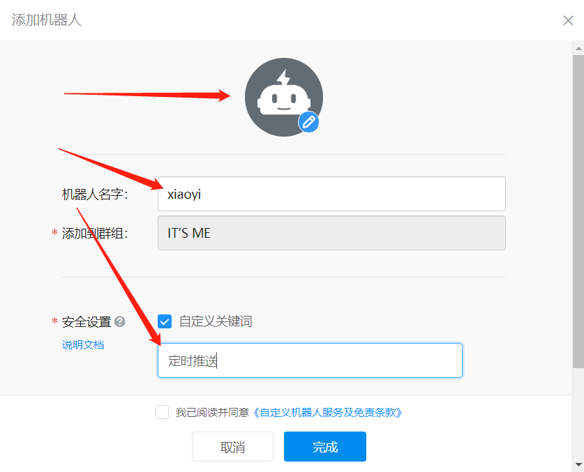
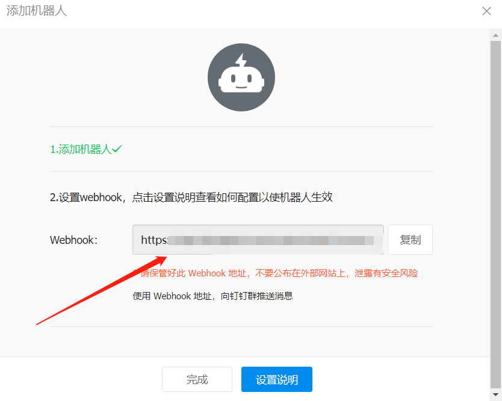
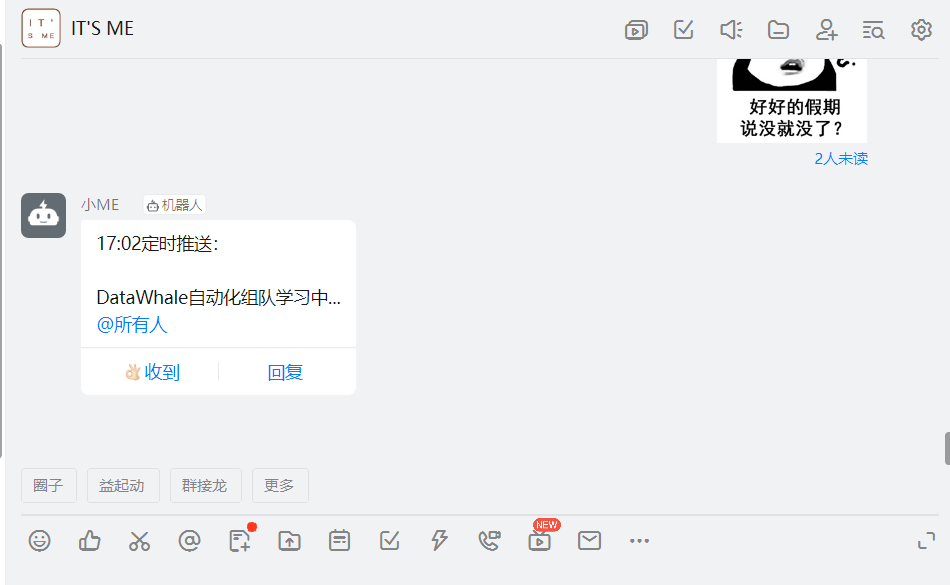
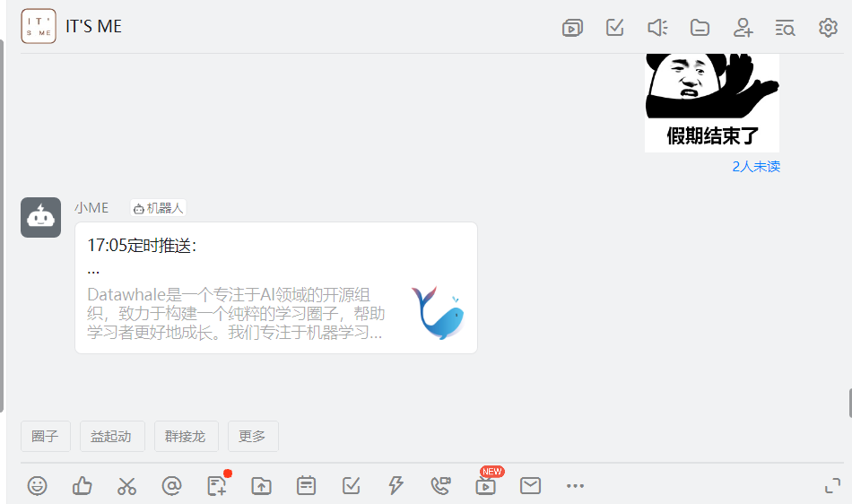
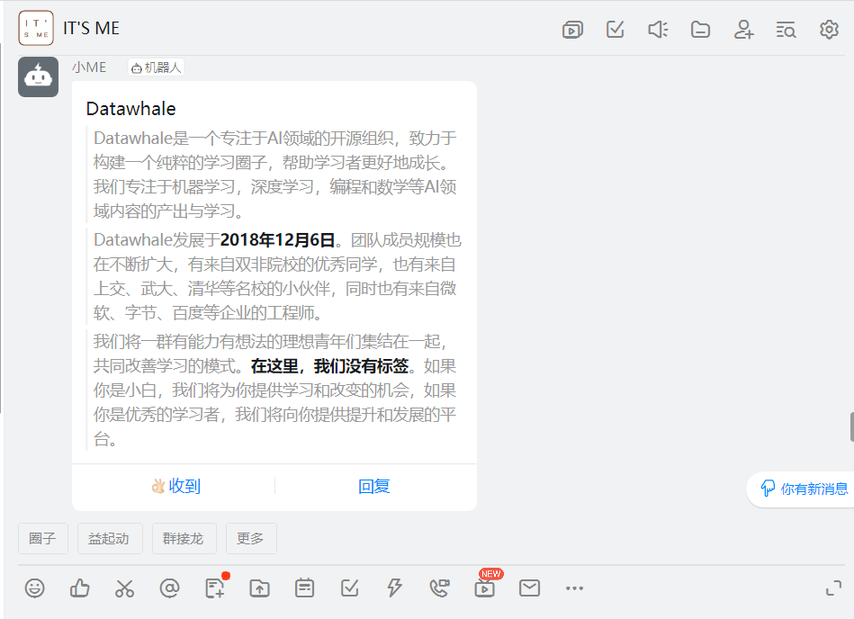
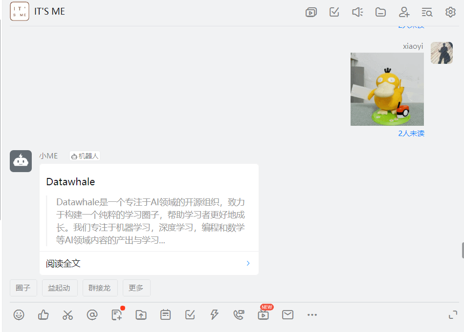
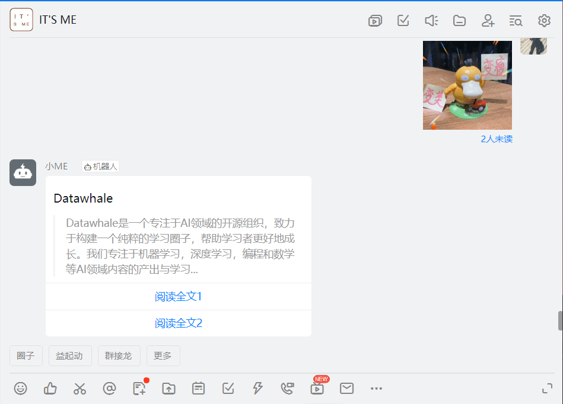
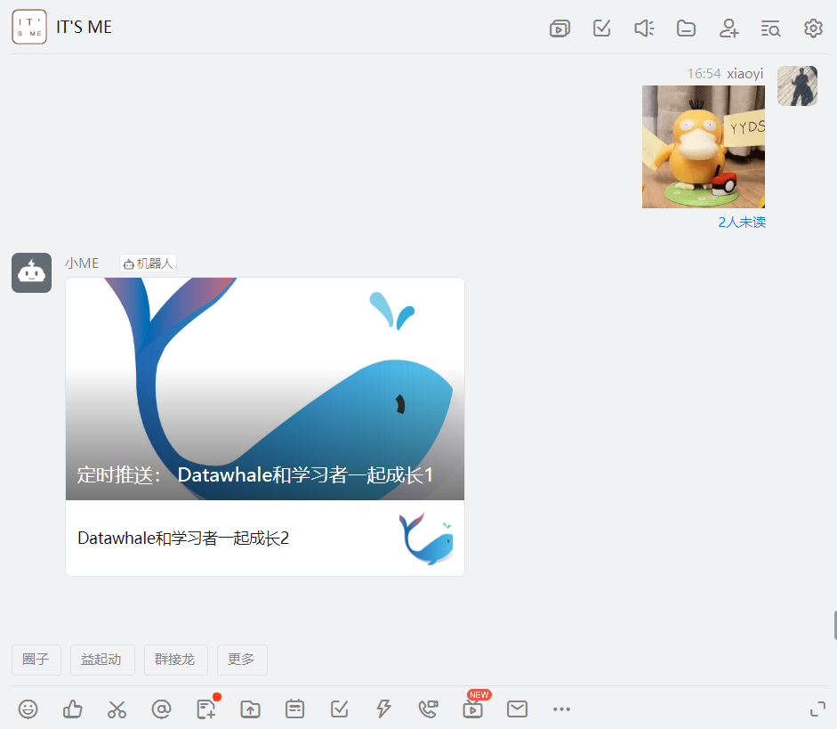

# Task 05 Python操作钉钉自动化
- [Task 05 Python操作钉钉自动化](#task-05-python操作钉钉自动化)
  - [1、创建钉钉群机器人](#1创建钉钉群机器人)
  - [2、使用自定义机器人实战](#2使用自定义机器人实战)
    - [①文本TEXT](#文本text)
    - [②链接LINK](#链接link)
    - [③markdown类型](#markdown类型)
    - [④整体跳转ActionCard类型](#整体跳转actioncard类型)
    - [⑤独立跳转ActionCard类型](#独立跳转actioncard类型)
    - [⑥FeedCard类型](#feedcard类型)

本文主要是对群聊消息的发送提供参考案例，实现对文字消息、图片消息、卡片消息等常规消息的发送，具体的，本文通过钉钉接口实现上述群聊消息的几大功能。更多详尽内容可参考：[钉钉机器人开发文档](https://open.dingtalk.com/document/robots/custom-robot-access)

> 通过Python操作钉钉群聊机器人发送消息

> 环境：python3.x

> 使用模块：requests，json

## 1、创建钉钉群机器人

使用钉钉机器人发送群消息的第一步是需要创建一个群聊。步骤如下：

首先我们打开钉钉，随便拉2个人，创建一个群聊，点击群设置中的智能群助手。



进入到机器人管理页面，点击添加机器人，进入机器人选择页面，这里选择自定义机器人。



需要给机器人修改头像和名称，在安全设置里面，建议最好把自定义关键字也勾选上，比如我这里设置的是：定时推送，然后其他的可以默认，点击完成后在新的页面有一个webhook





这个webhook比较重要，后面要用到，一定要备份好，不要公布在外部网站上，泄露后有安全风险。到此，群聊机器人就创建完成了。

需要注意的有两个：一个机器人的webhook，一个是自定义关键字


## 2、使用自定义机器人实战

获取到Webhook地址后，用户可以向这个地址发起HTTP POST 请求，即可实现给该钉钉群发送消息。

> 钉钉群聊机器人最新规定：
>
> - 发起POST请求时，必须将字符集编码设置成UTF-8。
> - 每个机器人每分钟最多发送20条。消息发送太频繁会严重影响群成员的使用体验，大量发消息的场景 (譬如系统监控报警) 可以将这些信息进行整合，通过markdown消息以摘要的形式发送到群里。

目前支持发送的消息有5种，分别是：**文本 (text)、链接 (link)、markdown、ActionCard、FeedCard**。个人使用中比较常用的有两种：分别是文本和链接，企业使用的时候，对于ActionCard类型的也比较常用。

具体需要根据自己的场景进行选择，以便能达到最好的展示样式。

自定义机器人发送消息时，可以通过手机号码指定“被@人列表”。在“被@人列表”里面的人员收到该消息时，会有@消息提醒。免打扰会话仍然通知提醒，首屏出现“有人@你”

### ①文本TEXT

文本型的消息类型，具体代码如下：

```
{
    "at": {
        "atMobiles":[
            "180xxxxxx"
        ],
        "atUserIds":[
            "user123"
        ],
        "isAtAll": false
    },
    "text": {
        "content":"我就是我, @XXX 是不一样的烟火"
    },
    "msgtype":"text"
}

```

上述中涉及的参数类型分别如下：

| **参数**  | **参数类型** | **是否必填** | **说明**                                                     |
| --------- | ------------ | ------------ | ------------------------------------------------------------ |
| msgtype   | String       | 是           | 消息类型，此时固定为：text。                                 |
| content   | String       | 是           | 消息内容。                                                   |
| atMobiles | Array        | 否           | 被@人的手机号。**注意** 在content里添加@人的手机号，且只有在群内的成员才可被@，非群内成员手机号会被脱敏。 |
| atUserIds | Array        | 否           | 被@人的用户userid。**注意** 在content里添加@人的userid。     |
| isAtAll   | Boolean      | 否           | 是否@所有人。                                                |

实战代码，可直接复制，替换自己的access_token即可运行

```python
import requests
import json
import datetime

def send_msg(token_dd, date_str, msg, at_all=False):
    """
    通过钉钉机器人发送内容
    @param date_str:
    @param msg:
    @param at_all:
    @return:
    """
    url = 'https://oapi.dingtalk.com/robot/send?access_token=' + token_dd
    headers = {'Content-Type': 'application/json;charset=utf-8'}
    content_str = "{0}定时推送：\n\n{1}\n".format(date_str, msg)
    
    data = {
        "msgtype": "text",
        "text": {
            "content": content_str
        },
        "at": {
            "isAtAll": at_all
        },
    }
    res = requests.post(url, data=json.dumps(data), headers=headers)
    print(res.text)
    
    return res.text

if __name__ == '__main__':
    token_dd = '你自己的webhook后面的access_token复制在此'
    note_str = "DataWhale自动化组队学习中..."
    date_str = datetime.datetime.now().strftime('%H:%M')
    send_msg(token_dd, date_str, note_str, True)

```

具体效果如下：



### ②链接LINK

链接型的消息类型，具体代码如下：

```
{
    "msgtype": "link", 
    "link": {
        "text": "这个即将发布的新版本，创始人xx称它为红树林。而在此之前，每当面临重大升级，产品经理们都会取一个应景的代号，这一次，为什么是红树林", 
        "title": "时代的火车向前开", 
        "picUrl": "", 
        "messageUrl": "https://www.dingtalk.com/s?__biz=MzA4NjMwMTA2Ng==&mid=2650316842&idx=1&sn=60da3ea2b29f1dcc43a7c8e4a7c97a16&scene=2&srcid=09189AnRJEdIiWVaKltFzNTw&from=timeline&isappinstalled=0&key=&ascene=2&uin=&devicetype=android-23&version=26031933&nettype=WIFI"
    }
}
```

上述中涉及的参数类型分别如下：

| **参数**   | **参数类型** | 是否必填 | **说明**                                                     |
| ---------- | ------------ | -------- | ------------------------------------------------------------ |
| msgtype    | String       | 是       | 消息类型，此时固定为：link。                                 |
| title      | String       | 是       | 消息标题。                                                   |
| text       | String       | 是       | 消息内容。如果太长只会部分展示。                             |
| messageUrl | String       | 是       | 点击消息跳转的URL，打开方式如下：移动端，在钉钉客户端内打开PC端默认侧边栏打开希望在外部浏览器打开，请参考[消息链接说明](https://open.dingtalk.com/document/app/message-link-description#section-7w8-4c2-9az) |
| picUrl     | String       | 否       | 图片URL。                                                    |

实战代码，可直接复制，替换自己的access_token即可运行

```python
import requests
import json
import datetime

def send_msg(token_dd, date_str):
    """
    通过钉钉机器人发送内容
    @param date_str:
    @return:
    """
    url = 'https://oapi.dingtalk.com/robot/send?access_token=' + token_dd
    headers = {'Content-Type': 'application/json;charset=utf-8'}
    content_str = "{0}定时推送：\n\n{1}\n".format(date_str, "Datawhale和学习者一起成长")
    
    data = {
        "msgtype": "link",
        "link": {
            "title": content_str,
            "text": "Datawhale是一个专注于AI领域的开源组织，致力于构建一个纯粹的学习圈子，帮助学习者更好地成长。我们专注于机器学习，深度学习，编程和数学等AI领域内容的产出与学习。Datawhale发展于2018年12月6日。团队成员规模也在不断扩大，有来自双非院校的优秀同学，也有来自上交、武大、清华等名校的小伙伴，同时也有来自微软、字节、百度等企业的工程师。我们将一群有能力有想法的理想青年们集结在一起，共同改善学习的模式。在这里，我们没有标签。如果你是小白，我们将为你提供学习和改变的机会，如果你是优秀的学习者，我们将向你提供提升和发展的平台。",
            "picUrl": "https://camo.githubusercontent.com/442350f57282653c563b8c6181f561452b6258632dc79d8a5298b724a37a42f7/68747470733a2f2f747661312e73696e61696d672e636e2f6c617267652f65366339643234656c793168316f69646f617469716a3231313030753061626e2e6a7067",
            "messageUrl": "https://linklearner.com/datawhale-homepage/index.html#/article/1"
        }
    }
    res = requests.post(url, data=json.dumps(data), headers=headers)
    print(res.text)
    
    return res.text

if __name__ == '__main__':
    token_dd = '你自己的webhook后面的access_token复制在此'
    note_str = "DataWhale自动化组队学习中..."
    date_str = datetime.datetime.now().strftime('%H:%M')
    send_msg(token_dd, date_str, note_str, True)
```

具体效果如下（文中的卡片可以直接跳转到DataWhale官网）：




### ③markdown类型

markdown的消息类型，具体代码如下：

```json
{
     "msgtype": "markdown",
     "markdown": {
         "title":"杭州天气",
         "text": "#### 杭州天气 @150XXXXXXXX \n > 9度，西北风1级，空气良89，相对温度73%\n > \n > ###### 10点20分发布 [天气](https://www.dingtalk.com) \n"
     },
      "at": {
          "atMobiles": [
              "150XXXXXXXX"
          ],
          "atUserIds": [
              "user123"
          ],
          "isAtAll": false
      }
 }
```

上述中涉及的参数类型分别如下：

| **参数**  | **类型** | 是否必填 | **说明**                                                     |
| --------- | -------- | -------- | ------------------------------------------------------------ |
| msgtype   | String   | 是       | 消息类型，此时固定为：markdown。                             |
| title     | String   | 是       | 首屏会话透出的展示内容。                                     |
| text      | String   | 是       | markdown格式的消息。                                         |
| atMobiles | Array    | 否       | 被@人的手机号。**注意** 在text内容里要有@人的手机号，只有在群内的成员才可被@，非群内成员手机号会被脱敏。 |
| atUserIds | Array    | 否       | 被@人的用户userid。**注意** 在content里添加@人的userid。     |
| isAtAll   | Boolean  | 否       | 是否@所有人。                                                |

实战代码，可直接复制，替换自己的access_token即可运行

```python
import requests
import json
import datetime

def send_msg(token_dd, date_str, at_all):
    """
    通过钉钉机器人发送内容
    @param date_str:
    @param at_all:
    @return:
    """
    url = 'https://oapi.dingtalk.com/robot/send?access_token=' + token_dd
    headers = {'Content-Type': 'application/json;charset=utf-8'}
    title_str = "{0}定时推送：\n\n{1}\n".format(date_str, "Datawhale和学习者一起成长")
    
    data = {
        "msgtype": "markdown",
        "markdown": {
            "title": title_str,
            "text": "### Datawhale \n > Datawhale是一个专注于AI领域的开源组织，致力于构建一个纯粹的学习圈子，帮助学习者更好地成长。我们专注于机器学习，深度学习，编程和数学等AI领域内容的产出与学习。\n\n > Datawhale发展于**2018年12月6日**。团队成员规模也在不断扩大，有来自双非院校的优秀同学，也有来自上交、武大、清华等名校的小伙伴，同时也有来自微软、字节、百度等企业的工程师。\n\n > 我们将一群有能力有想法的理想青年们集结在一起，共同改善学习的模式。**在这里，我们没有标签**。如果你是小白，我们将为你提供学习和改变的机会，如果你是优秀的学习者，我们将向你提供提升和发展的平台。",
        },
        "at": {
            "isAtAll": at_all
        }
    }
    
    res = requests.post(url, data=json.dumps(data), headers=headers)
    print(res.text)
    
    return res.text


if __name__ == '__main__':
    token_dd = '你自己的webhook后面的access_token复制在此'
    date_str = datetime.datetime.now().strftime('%H:%M')
    send_msg(token_dd, date_str, at_all=True)
```

具体效果如下：



### ④整体跳转ActionCard类型

整体跳转ActionCard的消息类型，具体代码如下：

```
{
    "actionCard": {
        "title": "乔布斯 20 年前想打造一间苹果咖啡厅，而它正是 Apple Store 的前身", 
        "text": " 
 ### 乔布斯 20 年前想打造的苹果咖啡厅 
 Apple Store 的设计正从原来满满的科技感走向生活化，而其生活化的走向其实可以追溯到 20 年前苹果一个建立咖啡馆的计划", 
        "btnOrientation": "0", 
        "singleTitle" : "阅读全文",
        "singleURL" : "https://www.dingtalk.com/"
    }, 
    "msgtype": "actionCard"
}
```

上述中涉及的参数类型分别如下：

| **参数**       | **类型** | **是否必填** | **说明**                                                     |
| -------------- | -------- | ------------ | ------------------------------------------------------------ |
| msgtype        | String   | 是           | 消息类型，此时固定为：actionCard。                           |
| title          | String   | 是           | 首屏会话透出的展示内容。                                     |
| text           | String   | 是           | markdown格式的消息。                                         |
| singleTitle    | String   | 是           | 单个按钮的标题。**注意** 设置此项和singleURL后，btns无效。   |
| singleURL      | String   | 是           | 点击消息跳转的URL，打开方式如下：移动端，在钉钉客户端内打开PC端默认侧边栏打开希望在外部浏览器打开，请参考[消息链接说明](https://open.dingtalk.com/document/app/message-link-description#section-7w8-4c2-9az) |
| btnOrientation | String   | 否           | 0：按钮竖直排列1：按钮横向排列                               |

实战代码，可直接复制，替换自己的access_token即可运行

```
import requests
import json
import datetime

def send_msg(token_dd, date_str):
    """
    通过钉钉机器人发送内容
    @param date_str:
    @return:
    """
    url = 'https://oapi.dingtalk.com/robot/send?access_token=' + token_dd
    headers = {'Content-Type': 'application/json;charset=utf-8'}
    title_str = "{0}定时推送：\n\n{1}\n".format(date_str, "Datawhale和学习者一起成长")
    
    data = {
        "msgtype": "actionCard",
        "actionCard": {
            "title": title_str,
            "text": "### Datawhale \n > Datawhale是一个专注于AI领域的开源组织，致力于构建一个纯粹的学习圈子，帮助学习者更好地成长。我们专注于机器学习，深度学习，编程和数学等AI领域内容的产出与学习...",
            "btnOrientation": "0",
            "singleTitle": "阅读全文",
            "singleURL": "https://linklearner.com/datawhale-homepage/index.html#/article/1"
        }
    }
    
    res = requests.post(url, data=json.dumps(data), headers=headers)
    print(res.text)
    
    return res.text

if __name__ == '__main__':
    token_dd = '你自己的webhook后面的access_token复制在此'
    date_str = datetime.datetime.now().strftime('%H:%M')
    send_msg(token_dd, date_str)
```

具体效果如下：



### ⑤独立跳转ActionCard类型

独立跳转ActionCard的消息类型，具体代码如下：

```
{
    "msgtype": "actionCard",
    "actionCard": {
        "title": "我 20 年前想打造一间苹果咖啡厅，而它正是 Apple Store 的前身", 
        "text": " \n\n #### 乔布斯 20 年前想打造的苹果咖啡厅 \n\n Apple Store 的设计正从原来满满的科技感走向生活化，而其生活化的走向其实可以追溯到 20 年前苹果一个建立咖啡馆的计划", 
        "btnOrientation": "0", 
        "btns": [
            {
                "title": "内容不错", 
                "actionURL": "https://www.dingtalk.com/"
            }, 
            {
                "title": "不感兴趣", 
                "actionURL": "https://www.dingtalk.com/"
            }
        ]
    }
}
```

上述中涉及的参数类型分别如下：

| **参数**       | **类型** | 是否必填 | 说明                                                         |
| -------------- | -------- | -------- | ------------------------------------------------------------ |
| msgtype        | String   | 是       | 此消息类型为固定actionCard。                                 |
| title          | String   | 是       | 首屏会话透出的展示内容。                                     |
| text           | String   | 是       | markdown格式的消息。                                         |
| btns           | Array    | 是       | 按钮。                                                       |
| title          | String   | 是       | 按钮标题。                                                   |
| actionURL      | String   | 是       | 点击按钮触发的URL，打开方式如下：移动端，在钉钉客户端内打开PC端默认侧边栏打开希望在外部浏览器打开，请参考[消息链接说明](https://open.dingtalk.com/document/app/message-link-description#section-7w8-4c2-9az) |
| btnOrientation | String   | 否       | 0：按钮竖直排列1：按钮横向排列                               |

实战代码，可直接复制，替换自己的access_token即可运行

```
import requests
import json
import datetime

def send_msg(token_dd, date_str):
    """
    通过钉钉机器人发送内容
    @param date_str:
    @return:
    """
    url = 'https://oapi.dingtalk.com/robot/send?access_token=' + token_dd
    headers = {'Content-Type': 'application/json;charset=utf-8'}
    title_str = "{0}定时推送：\n\n{1}\n".format(date_str, "Datawhale和学习者一起成长")
    
    data = {
        "msgtype": "actionCard",
        "actionCard": {
            "text": "### Datawhale \n > Datawhale是一个专注于AI领域的开源组织，致力于构建一个纯粹的学习圈子，帮助学习者更好地成长。我们专注于机器学习，深度学习，编程和数学等AI领域内容的产出与学习...",
            "title": title_str,
            "btnOrientation": "0",
            "btns": [
                {
                    "title": "阅读全文1",
                    "actionURL": "https://linklearner.com/datawhale-homepage/index.html#/article/1"
                },
                {
                    "title": "阅读全文2",
                    "actionURL": "https://linklearner.com/datawhale-homepage/index.html#/article/1"
                }
            ]
        }
    }
    
    res = requests.post(url, data=json.dumps(data), headers=headers)
    print(res.text)
    
    return res.text

if __name__ == '__main__':
    token_dd = '你自己的webhook后面的access_token复制在此'
    date_str = datetime.datetime.now().strftime('%H:%M')
    send_msg(token_dd, date_str)
```


具体效果如下：




### ⑥FeedCard类型

FeedCard的消息类型，具体代码如下：

```
{
    "msgtype":"feedCard",
    "feedCard": {
        "links": [
            {
                "title": "时代的火车向前开1", 
                "messageURL": "https://www.dingtalk.com/", 
                "picURL": "https://img.alicdn.com/tfs/TB1NwmBEL9TBuNjy1zbXXXpepXa-2400-1218.png"
            },
            {
                "title": "时代的火车向前开2", 
                "messageURL": "https://www.dingtalk.com/", 
                "picURL": "https://img.alicdn.com/tfs/TB1NwmBEL9TBuNjy1zbXXXpepXa-2400-1218.png"
            }
        ]
    }
}
```

上述中涉及的参数类型分别如下：

| **参数**   | **类型** | 是否必填 | **说明**                                                     |
| ---------- | -------- | -------- | ------------------------------------------------------------ |
| msgtype    | String   | 是       | 此消息类型为固定feedCard。                                   |
| title      | String   | 是       | 单条信息文本。                                               |
| messageURL | String   | 是       | 点击单条信息到跳转链接。**说明** PC端跳转目标页面的方式，参考[消息链接在PC端侧边栏或者外部浏览器打开](https://open.dingtalk.com/document/app/message-link-description#section-7w8-4c2-9az)。 |
| picURL     | String   | 是       | 单条信息后面图片的URL。                                      |

实战代码，可直接复制，替换自己的access_token即可运行

```
import requests
import json
import datetime

def send_msg(token_dd):
    """
    通过钉钉机器人发送内容
    """
    url = 'https://oapi.dingtalk.com/robot/send?access_token=' + token_dd
    headers = {'Content-Type': 'application/json;charset=utf-8'}
    title_str = "定时推送：\n\n{0}\n".format("Datawhale和学习者一起成长1")

    data = {
        "msgtype": "feedCard",
        "feedCard": {
            "links": [{
                    "title": title_str,
                    "messageURL": "https://linklearner.com/datawhale-homepage/index.html#/article/1",
                    "picURL": "https://camo.githubusercontent.com/442350f57282653c563b8c6181f561452b6258632dc79d8a5298b724a37a42f7/68747470733a2f2f747661312e73696e61696d672e636e2f6c617267652f65366339643234656c793168316f69646f617469716a3231313030753061626e2e6a7067"
                }, {
                    "title": "Datawhale和学习者一起成长2",
                    "messageURL": "https://linklearner.com/datawhale-homepage/index.html#/article/1",
                    "picURL": "https://camo.githubusercontent.com/442350f57282653c563b8c6181f561452b6258632dc79d8a5298b724a37a42f7/68747470733a2f2f747661312e73696e61696d672e636e2f6c617267652f65366339643234656c793168316f69646f617469716a3231313030753061626e2e6a7067"
                }
            ]
        }
    }
    
    res = requests.post(url, data=json.dumps(data), headers=headers)
    print(res.text)
    
    return res.text

if __name__ == '__main__':
    token_dd = '你自己的webhook后面的access_token复制在此'
    send_msg(token_dd)
```

具体效果如下：




以上就是本小节的所有内容。

Task04 END

> By: xiaoyi
>
> Datawhale成员，数据分析从业者


